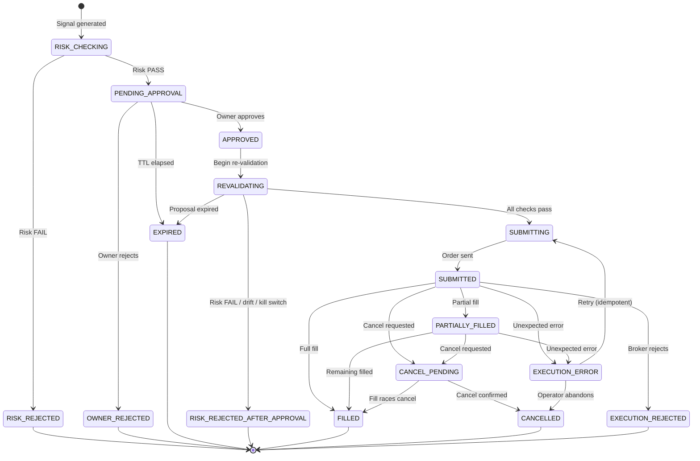

# ORDER_STATE_MACHINE.md

## Trade Proposal State Machine

Every trade proposal moves through an explicit set of states.
Illegal transitions must be rejected at the database and application layer.

---

## States

| State | Description |
|---|---|
| `SIGNAL_CREATED` | A strategy has emitted a signal. Not yet a proposal. |
| `RISK_CHECKING` | Initial risk evaluation in progress. |
| `RISK_REJECTED` | Initial risk check failed. No proposal will be created. |
| `PENDING_APPROVAL` | Risk passed; proposal is waiting for owner decision. Trading parameters are now **immutable**. |
| `OWNER_REJECTED` | Owner explicitly rejected the proposal. Terminal. |
| `EXPIRED` | Proposal TTL elapsed before approval or execution completed. Terminal. |
| `APPROVED` | Owner approved; transitioning to re-validation. |
| `REVALIDATING` | Second risk check in progress (post-approval). |
| `RISK_REJECTED_AFTER_APPROVAL` | Second risk check failed. Terminal. |
| `SUBMITTING` | Execution record created; order being sent to PaperBroker. |
| `SUBMITTED` | Order acknowledged by PaperBroker. |
| `PARTIALLY_FILLED` | Some quantity filled; remainder pending. |
| `FILLED` | Full quantity filled. Terminal (success). |
| `CANCEL_PENDING` | Cancellation requested; awaiting broker acknowledgement. |
| `CANCELLED` | Order fully cancelled. Terminal. |
| `EXECUTION_REJECTED` | PaperBroker rejected the order (e.g. insufficient paper funds). Terminal. |
| `EXECUTION_ERROR` | Unexpected error during submission. May be retried. |

---

## State Transition Table

| From | Event | To |
|---|---|---|
| *(none)* | Signal generated, risk check starts | `RISK_CHECKING` |
| `RISK_CHECKING` | Risk engine returns REJECT | `RISK_REJECTED` |
| `RISK_CHECKING` | Risk engine returns PASS | `PENDING_APPROVAL` |
| `PENDING_APPROVAL` | Owner approves | `APPROVED` |
| `PENDING_APPROVAL` | Owner rejects | `OWNER_REJECTED` |
| `PENDING_APPROVAL` | TTL elapses | `EXPIRED` |
| `APPROVED` | Re-validation starts | `REVALIDATING` |
| `REVALIDATING` | Second risk check returns REJECT | `RISK_REJECTED_AFTER_APPROVAL` |
| `REVALIDATING` | Price drift exceeds threshold | `RISK_REJECTED_AFTER_APPROVAL` |
| `REVALIDATING` | Proposal expired during re-validation | `EXPIRED` |
| `REVALIDATING` | Kill switch disabled | `RISK_REJECTED_AFTER_APPROVAL` |
| `REVALIDATING` | All checks pass | `SUBMITTING` |
| `SUBMITTING` | Order sent to PaperBroker | `SUBMITTED` |
| `SUBMITTED` | Partial fill received | `PARTIALLY_FILLED` |
| `SUBMITTED` | Full fill received | `FILLED` |
| `SUBMITTED` | Broker rejection received | `EXECUTION_REJECTED` |
| `SUBMITTED` | Unexpected error | `EXECUTION_ERROR` |
| `PARTIALLY_FILLED` | Additional fill completes order | `FILLED` |
| `PARTIALLY_FILLED` | Cancellation requested and confirmed | `CANCELLED` |
| `PARTIALLY_FILLED` | Unexpected error | `EXECUTION_ERROR` |
| `SUBMITTED` | Cancellation requested | `CANCEL_PENDING` |
| `CANCEL_PENDING` | Cancellation confirmed | `CANCELLED` |
| `CANCEL_PENDING` | Fill received before cancel processed | `FILLED` |
| `EXECUTION_ERROR` | Retry attempted (idempotent) | `SUBMITTING` |
| `EXECUTION_ERROR` | Operator abandons | `CANCELLED` |

---

## Terminal States

These states have no outgoing transitions:

- `RISK_REJECTED`
- `OWNER_REJECTED`
- `EXPIRED`
- `RISK_REJECTED_AFTER_APPROVAL`
- `FILLED`
- `CANCELLED`
- `EXECUTION_REJECTED`

---

## State Machine Diagram

---

## Enforcement

### Database Layer
- `trade_proposals.status` column is a PostgreSQL `ENUM` type.
- All transitions must be performed via stored procedures or checked constraints.
- `CHECK` constraint or trigger validates that only legal `(from_status, to_status)` pairs are applied.

### Application Layer
- `ProposalStateMachine` class in `apps/api` defines all allowed transitions as an explicit map.
- Any attempt to transition to an illegal state raises a `InvalidStateTransitionError`.
- All state changes are wrapped in a database transaction with `SELECT FOR UPDATE` on the proposal row.

### Idempotency Key
- `executions.idempotency_key` has a `UNIQUE` constraint.
- Key is derived from `proposal_id + execution_attempt_number`.
- On retry, the same key is reused — if the execution row already exists, return the existing result.

---

## Bracket Exit Reconciliation (orders sub-state, phase 22/23)

A bracket proposal's own state machine is unaffected by its exit — it still
transitions `SUBMITTED → FILLED` on the entry fill and stays terminal at
`FILLED`. What happens next lives on the `orders` table, one level below the
proposal:

- The entry order gets `bracket_order_ids: {parent, take_profit, stop_loss}`
  when submitted (see "Bracket Orders" in `docs/PAPER_BROKER.md`).
- When the broker reports either exit leg filled, `recordApprovedBracketExit`
  creates a **new** `orders` row (side `SELL`) for that fill, sets its
  `exit_reason` to `TAKE_PROFIT` or `STOP_LOSS`, records `cancelled_leg` for
  the opposite leg in `bracket_order_ids`, and updates the `positions` table
  and portfolio snapshot accordingly.
- This is triggered by `reconcileBracketOrders`, not by any proposal-status
  transition — it runs at API startup and on every dashboard load, so a
  browser/app restart does not affect an Alpaca-hosted bracket's SL/TP (those
  live on Alpaca's servers) and the local ledger catches up the next time
  something polls.
- `recordApprovedBracketExit` is idempotent per broker `fill_id`: replaying
  the same exit fill is a no-op on the second call.

---

## Signal State (separate from Proposal)

Signals have their own simpler state:

| State | Description |
|---|---|
| `CREATED` | Signal emitted by strategy |
| `RISK_PASS` | Converted into a proposal |
| `RISK_FAIL` | Risk check failed, no proposal |
| `EXPIRED` | No action taken within TTL |

A Signal is separate from a Trade Proposal.
One Signal leads to at most one Trade Proposal.
